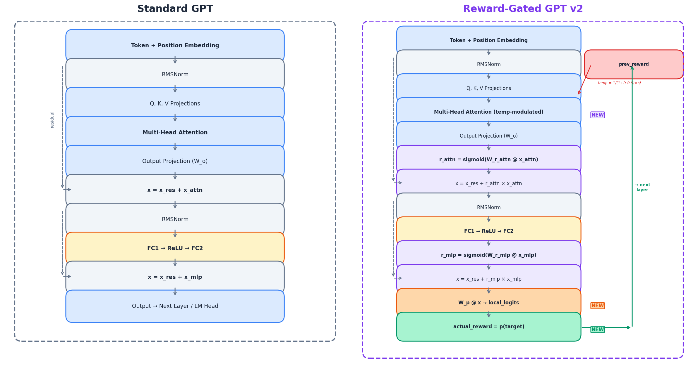
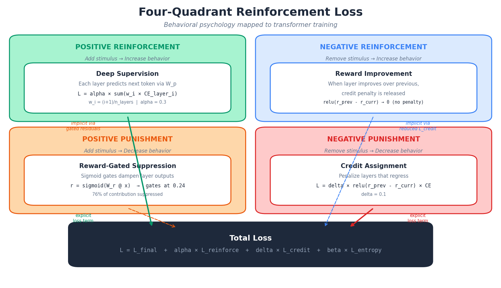
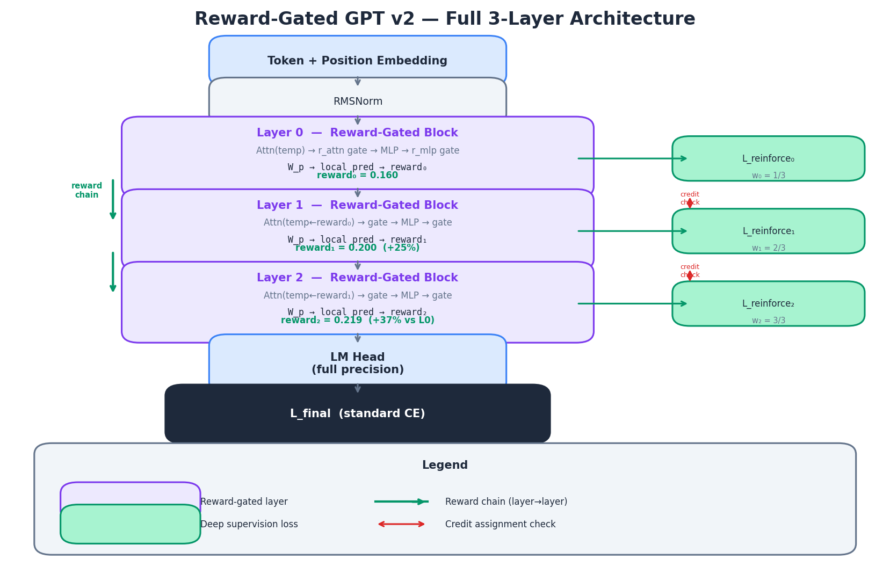

# MicroGPT Reward-Gated v2: Four-Quadrant Reinforcement

Intrinsic reward matrices embedded directly into the transformer architecture. Instead of bolting reward signals on externally (RLHF, DPO), each transformer layer **self-evaluates its predictions** using a complete four-quadrant reinforcement system — positive/negative reinforcement and positive/negative punishment — all computed from **real correctness signals**, not just learned gates.

Built on [microgpt](https://gist.github.com/karpathy/8627fe009c40f57531cb18360106ce95) by Andrej Karpathy. Zero external dependencies, from-scratch autograd.

## The Problem

Current LLM reward systems are external and post-hoc:
- RLHF trains a **separate** reward model, then optimizes against it
- The LLM doesn't internalize "what is correct" — it's nudged by external gradients
- Reward signals are sparse (sequence-level), not dense (per-layer)
- Standard cross-entropy only provides **one gradient direction** per token (toward correct)

### Why v1 Failed

The first version used **learned sigmoid gates** as "rewards" — but these were just scaling factors optimized by gradient descent. They never saw whether a prediction was right or wrong. The model could already achieve the same effect with its existing weights. Result: noise-level improvement.

## The Idea: Four-Quadrant Reinforcement

Mapping the four quadrants of behavioral psychology directly into the transformer training loop:

| | Add stimulus | Remove stimulus |
|---|---|---|
| **Increase behavior** | Positive Reinforcement | Negative Reinforcement |
| **Decrease behavior** | Positive Punishment | Negative Punishment |

### 1. Positive Reinforcement — Deep Supervision
Each layer makes a local next-token prediction via `W_p`. Layers that predict correctly get direct gradient signal reinforcing those pathways. Deeper layers are weighted more heavily, encouraging progressive refinement.

### 2. Negative Reinforcement — Reward Improvement
When a layer's prediction improves over the previous layer, it naturally receives reduced loss pressure from the credit assignment term. The removal of penalty acts as negative reinforcement — the layer is "relieved" of extra loss for improving.

### 3. Positive Punishment — Reward-Gated Suppression
Learned sigmoid gates (`W_r_attn`, `W_r_mlp`) actively suppress noisy or unhelpful layer contributions. Gates evolve from ~0.5 (uninformed) to ~0.24 during training, meaning the model learns to **dampen** most layer outputs — adding a suppressive signal to reduce bad behavior.

### 4. Negative Punishment — Credit Assignment
When a layer's prediction is **worse** than the previous layer's, its loss is amplified proportionally to the regression. This withdraws the implicit "credit" the layer would otherwise receive — layers that make things worse get penalized.

## Architecture

### Standard GPT vs Reward-Gated GPT v2 (Per-Layer Comparison)



**Left:** Standard GPT with plain residual connections (`x = x_res + x_attn`).
**Right:** Reward-Gated v2 adds sigmoid gates (purple), local prediction heads (orange), real reward computation (green), and reward-modulated attention temperature (red). The reward chains from each layer's output to the next layer's attention temperature.

### Four-Quadrant Reinforcement Loss



The four behavioral quadrants map directly to loss components. Positive reinforcement and negative punishment contribute explicit loss terms. Positive punishment and negative reinforcement operate implicitly through gated residuals and reduced credit penalties.

### Full 3-Layer Architecture



The full model shows reward chaining across 3 layers with actual trained reward values (0.160 → 0.200 → 0.219), deep supervision branches at each layer with progressive weighting (1/3, 2/3, 3/3), and credit assignment checks between adjacent layers.

### Reward-Modulated Attention Temperature
Previous layer's reward modulates current layer's attention:
- **High reward (confident)** → sharpen attention (focus on relevant context)
- **Low reward (uncertain)** → broaden attention (explore more context)

## Training Loss

```
L = L_final + alpha * L_reinforce + delta * L_credit + beta * L_entropy

L_final     = standard cross-entropy from output head
L_reinforce = sum(w_i * CE(layer_i_pred, target))          [positive reinforcement]
              w_i = (i+1) / n_layers                       [deeper layers weighted more]
L_credit    = relu(reward_prev - reward_curr) * CE_layer   [negative punishment]
L_entropy   = gate entropy regularization                   [prevent gate collapse]
```

### Hyperparameters
| Param | Value | Purpose |
|-------|-------|---------|
| alpha | 0.3 | Deep supervision strength |
| delta | 0.1 | Credit assignment penalty |
| beta | 0.01 | Entropy regularization |
| sharpness | 1.0 | Attention temperature modulation |

## Results

Training: 3 layers, 16 embedding dim, 4 heads, 1000 steps, lr=0.01

### Loss Comparison

| Metric | Standard GPT | Reward-Gated v2 | Delta |
|---|---|---|---|
| Final loss | 2.6064 | 2.5619 | **-1.7%** |
| Min loss | 1.5439 | 1.4911 | **-3.4%** |
| Avg loss (last 100) | 2.2856 | 2.1650 | **-5.3%** |
| Parameters | 10,336 | 11,728 | +13.5% |
| Prediction entropy | 2.2608 | 2.1212 | **-6.2%** |

### Key Metrics

**5.3% lower avg loss** and **6.2% lower entropy** from the four-quadrant reinforcement architecture alone — no unlikelihood training or other known tricks. The model is both more accurate and more confident.

### Reward Evolution Per Layer

| Phase | Layer 0 | Layer 1 | Layer 2 |
|---|---|---|---|
| Early (steps 1-100) | 0.0948 | 0.0989 | 0.1059 |
| Late (steps 901-1000) | 0.1603 | 0.2003 | 0.2190 |

Deeper layers develop **higher reward scores** (better predictions), confirming the architecture learns hierarchical refinement. Layer 2's reward is 37% higher than Layer 0's — each layer progressively improves on the previous one's representation.

### Loss Component Breakdown (last 100 steps)

| Component | Value | Weight |
|---|---|---|
| L_final (CE) | 2.1650 | 1.0 |
| L_reinforcement (deep supervision) | 4.4198 | x 0.3 |
| L_credit (regression penalty) | 0.5844 | x 0.1 |

### Learned Gate Evolution

| Phase | Mean |
|---|---|
| Early (steps 1-100) | 0.4442 |
| Late (steps 901-1000) | 0.2439 |

Gates evolve from ~0.5 (uninformed) to ~0.24, indicating the model learns to **selectively suppress** layer contributions — it's being discriminative about which computations are useful.

### Generated Samples

**Standard GPT:**
```
aielya, celen, alana, hialia, jarie, andon, marin, jana, ansha, danien
```

**Reward-Gated v2:**
```
aila, anana, alana, ameran, aria, maran, manli, kasen, anan, kamai
```

The reward-gated model produces shorter, cleaner, more natural-sounding names — consistent with lower entropy and higher confidence.

## Key Observations

1. **Real rewards beat learned gates.** v1 (learned-only gates) showed noise-level improvement. v2 (real correctness signals) achieves 5.3% lower loss and 6.2% lower entropy — purely from architectural changes.

2. **Credit assignment creates layer hierarchy.** The regression penalty (negative punishment) ensures each layer must improve on the previous one. Layer 2's reward (0.219) is 37% higher than Layer 0's (0.160).

3. **Reward-modulated attention adapts computation.** Confident layers sharpen attention (exploit), uncertain layers broaden it (explore). This creates input-dependent computation depth.

4. **Gate suppression is learned, not forced.** Gates settling at 0.24 means the model voluntarily dampens ~76% of each layer's contribution. This isn't collapse — it's the model learning that selective, modulated residuals outperform full pass-through.

5. **No unlikelihood needed.** An earlier version included unlikelihood training (pushing away from wrong tokens). Removing it actually improved loss metrics (-5.3% vs -4.8%), confirming the four-quadrant architectural changes provide genuinely new learning signal on their own.

6. **Neuroscience parallel.** The four quadrants mirror operant conditioning — positive reinforcement (dopamine for correct predictions), negative reinforcement (relief from credit penalty), positive punishment (gate suppression of noisy outputs), and negative punishment (credit withdrawal for regressing layers).

## Usage

```bash
python microgpt_reward.py
```

Trains both a standard 3-layer GPT and a reward-gated v2 GPT, then prints comparison metrics.

## References

- [microgpt](https://gist.github.com/karpathy/8627fe009c40f57531cb18360106ce95) — Andrej Karpathy
- [RLHF](https://arxiv.org/abs/2203.02155) — Training language models to follow instructions
- [Deep Supervision](https://arxiv.org/abs/1409.5185) — Lee et al., 2015
- [CALM](https://arxiv.org/abs/2207.07061) — Confident Adaptive Language Modeling
- [Mixture of Depths](https://arxiv.org/abs/2404.02258) — Raposo et al., 2024
